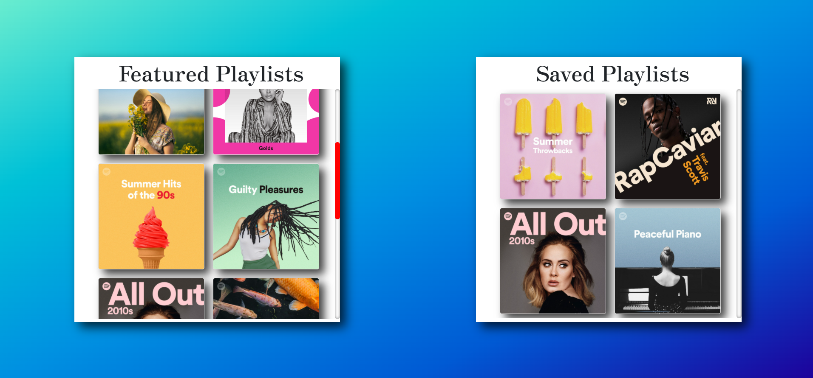
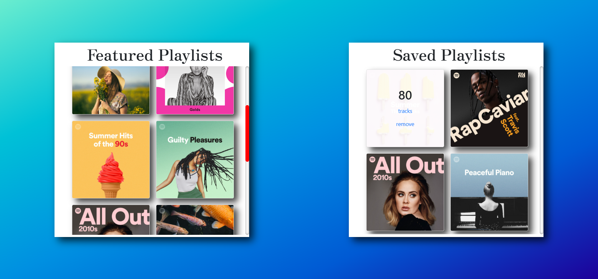
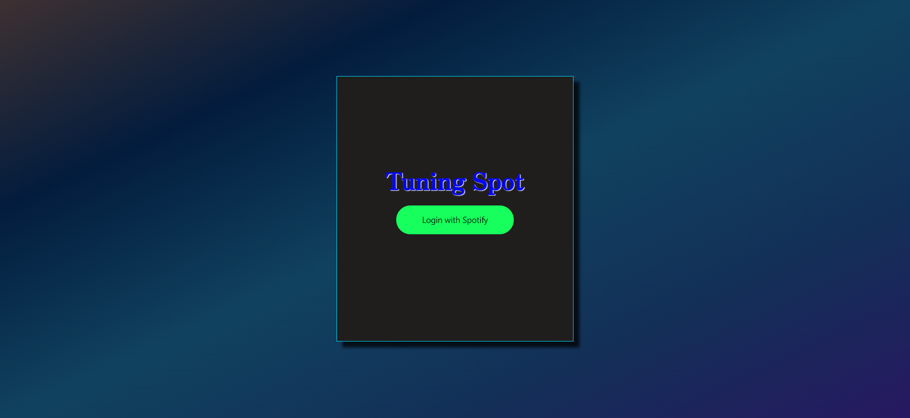

# Tuning Spot
Saved Spotify Playlists locally

# 🚛 Features
- 👆 Drag & Drop
- 🔍 Saved Playlists
- 🖼 Responsive UI

# 🏗 Built with
- React.js

### 🍔 Things Used
- ♟ useState 
- ♟ useEffect
- ♟ spotify-web-api

### API Used
- Spotify API

# 📷 Screenshots
 
 
 

